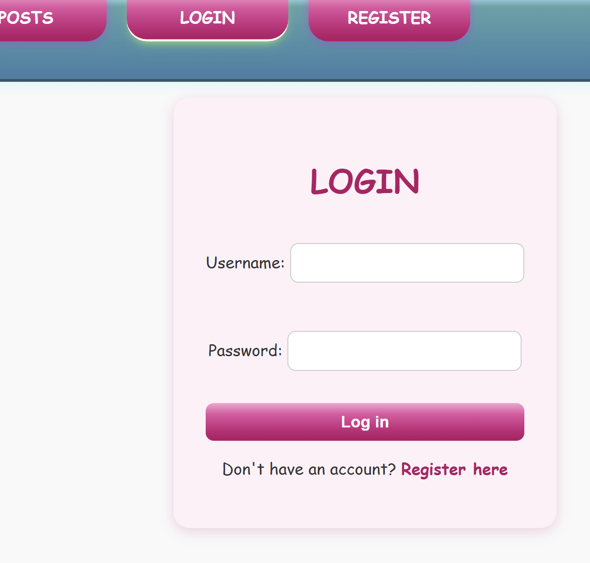
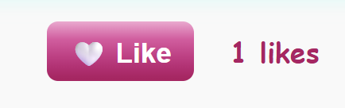
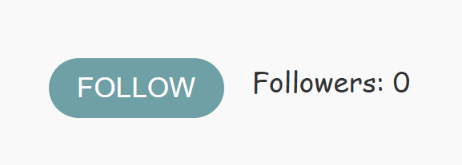
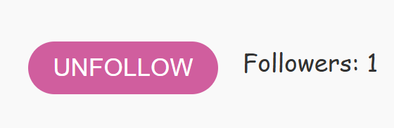
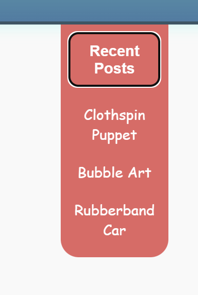
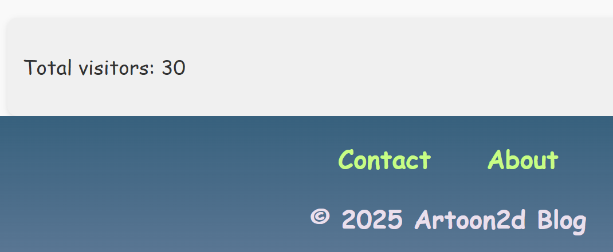
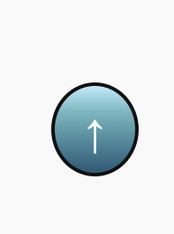
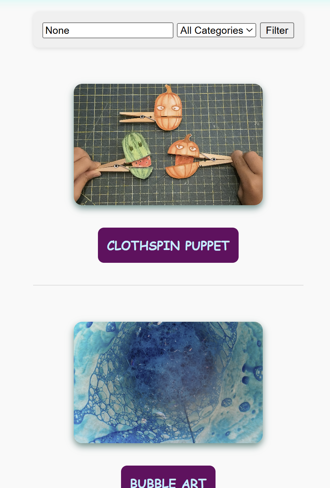
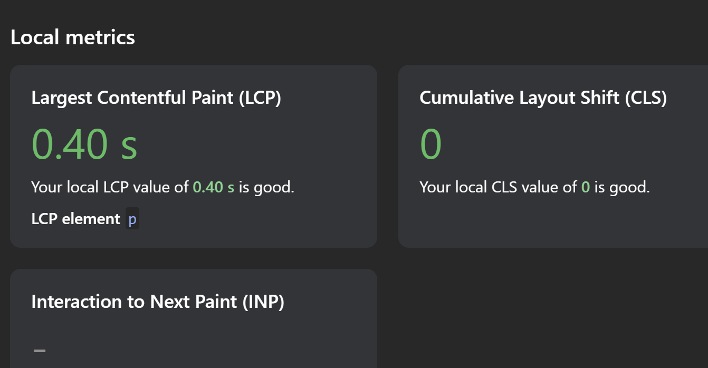

# ARTOON2D
## Project: Artoon2D Blog Platform 
Welcome to **Artoon2D Blog**, a creative space built with Django for sharing artistic inspiration, tutorials, and resources for curious children and their parents. This blog is designed to be fun, educational, and community-driven.
A blogging platform with social interaction (likes, follows), media support, and author-controlled content.
---
## User Stories
### Epics Overview
Epic |  Description<br>
------|-------------------------------
EPIC 1 |	User Accounts & Identity<br>
EPIC 2 |	Core Content Management<br>
EPIC 3 |	Engagement & Community<br>
EPIC 4 |	Visibility & Reach<br>
EPIC 5 |	Visual Experience<br>
EPIC 6 |	Stability & Protection<br>


| **Epic / Milestone**                                                       | **Priority**   | **User Story**                                                                                                                   |
| -------------------------------------------------------------------------- | -------------- | -------------------------------------------------------------------------------------------------------------------------------- |
| **Epic 1 — User Authentication & Profiles**<br> User Accounts & Identity   | 🟢 MUST HAVE   | US1.1: Register and log in to create/manage posts.<br>US1.2: Automatic profile creation.<br>US1.3: Display author name on posts. |
|                                                                            | 🟡 SHOULD HAVE | US1.4: Upload avatar.<br>US1.5: Add short bio.                                                                                   |
|                                                                            | 🔵 COULD HAVE  | US1.6: See profile visitor count.                                                                                                |
|                                                                            | 🔴 WON’T HAVE  | US1.7: Custom privacy settings.                                                                                                  |
| **Epic 2 — Post Creation & Management**<br> Core Content Management        | 🟢 MUST HAVE   | US2.1: Create posts.<br>US2.2: Edit own posts.<br>US2.3: Delete own posts.<br>US2.4: Unique URLs.                                |
|                                                                            | 🟡 SHOULD HAVE | US2.5: Categorize posts.<br>US2.6: Add tags.                                                                                     |
|                                                                            | 🔵 COULD HAVE  | US2.7: Add theme label.                                                                                                          |
|                                                                            | 🔴 WON’T HAVE  | US2.8: Scheduled publishing.                                                                                                     |
| **Epic 3 — Social Interaction**<br> Engagement & Community                 | 🟢 MUST HAVE   | US3.1: Like posts.<br>US3.2: Unlike posts.<br>US3.3: See like count.                                                             |
|                                                                            | 🟡 SHOULD HAVE | US3.4: Follow users.<br>US3.5: Unfollow users.                                                                                   |
|                                                                            | 🔵 COULD HAVE  | US3.6: See followers count.                                                                                                      |
|                                                                            | 🔴 WON’T HAVE  | US3.7: Real-time notifications.                                                                                                  |
| **Epic 4 — Content Discovery & SEO**<br> Visibility & Reach                | 🟢 MUST HAVE   | US4.1: View post list.<br>US4.2: View single post.                                                                               |
|                                                                            | 🟡 SHOULD HAVE | US4.3: SEO metadata.<br>US4.4: Canonical URLs.                                                                                   |
|                                                                            | 🔵 COULD HAVE  | US4.5: Filter by category/tag.                                                                                                   |
|                                                                            | 🔴 WON’T HAVE  | US4.6: Full-text search.                                                                                                         |
| **Epic 5 — Media & UI/UX**<br> Visual Experience                           | 🟢 MUST HAVE   | US5.1: Upload images.                                                                                                            |
|                                                                            | 🟡 SHOULD HAVE | US5.2: Optimized images.<br>US5.3: Responsive layout.                                                                            |
|                                                                            | 🔵 COULD HAVE  | US5.4: Lazy-loading images.                                                                                                      |
|                                                                            | 🔴 WON’T HAVE  | US5.5: Video uploads.                                                                                                            |
| **Epic 6 — Performance, Safety & Integrity**<br> Stability & Protection    | 🟢 MUST HAVE   | US6.1: Prevent double-saving posts.<br>US6.2: Toggle likes safely.<br>US6.3: Only authors can edit/delete posts.                 |
|                                                                            | 🟡 SHOULD HAVE | US6.4: Confirmation dialogs for destructive actions.                                                                             |
|                                                                            | 🔵 COULD HAVE  | US6.5: Automated tests for regressions.                                                                                          |
|                                                                            | 🔴 WON’T HAVE  | US6.6: Offline editing.                                                                                                          |

---

## Features

-  Post creation, editing, and deletion (admin interface)<br>
- Secure user authentication and registration <br>

-  Like and follow functionality for registered users<br>




- Dropdown Menu with recent Posts<br>
- Share buttons for Mastodon, Pixelfeld, and Friendica<br>
- Informative About page and contact link<br>
- Visitor Counter<br>

- Carousel for featured images<br>
- Tagging system via `django-taggit`<br>

-  Scroll-up button<br>


---

## Tech Stack

- **Backend**: Django 5.2.5<br>
- **Database**: PostgreSQL<br>
- **Frontend**: HTML, CSS (Flexbox & Grid), JavaScript<br>
- **Authentication**: Django's built-in user system<br>
- **Admin Panel**: `django.contrib.admin`<br>
- **Tagging**: `django-taggit`<br>

---

## Colors and Typography

The color palette of Artoon2D Blog consists of pastel and vibrant tones, carefully selected to create a friendly and playful atmosphere. These colors are limited in number to ensure visual consistency and are associated with a family- and kids-friendly design, enhancing readability and creating an inviting experience for all visitors.

The typography complements this approach with Comic Sans MS, using uppercase headings for emphasis and a light, approachable style for body text and lists.


### Project Structure

```text
artoon2d/
├── manage.py
├── requirements.txt
├── .env.example
├── .gitignore
├── README.md
│
├── artoon2d/                     # Django project (settings)
│   ├── __init__.py
│   ├── asgi.py
│   ├── settings.py
│   ├── urls.py
│   └── wsgi.py
│
├── artoon2d_blog/                # Django app
│   ├── __init__.py
│   ├── admin.py
│   ├── apps.py
│   ├── models.py
│   ├── views.py
│   ├── urls.py
│   ├── tests/
│   │   ├── __init__.py
│   │   ├── test_likes.py    # Model-level tests (pytest)
│   │   ├── test_posts.py    # Like toggle logic
│   │   └── test_follows.py  # Follow / unfollow behavior
│   │   └── test_views.py    # Integration tests (Django TestCase)
│   │
│   ├── migrations/
│   │   └── __init__.py
│   │
│   ├── templates/
│   │   └── artoon2d_blog/
│   │       ├── base.html
│   │       ├── home.html
│   │       ├── post_list.html
│   │       ├── post_detail.html
│   │       ├── post_form.html
│   │       ├── post_confirm_delete.html
│   │       ├── sidebar.html
│   │       ├── robots.txt
│   │       │
│   │       └── components/
│   │           ├── follow_button.html
│   │           ├── like_button.html
│   │
│   ├── static/
│   │   └── artoon2d_blog/
│   │       ├── css/
│   │       │   └── main.css
│   │       ├── js/
│   │       │   ├── follow.js
│   │       │   └── scripts.js
│   │       └── images/
│   │
│   └── templatetags/
│       ├── __init__.py
│       └── blog_extras.py
│
└── media/                         # Local uploads (gitignored)
```

## Testing

This project includes a small but reliable test suite designed to validate core functionality and prevent regressions while keeping maintenance overhead low.
The testing strategy intentionally combines Django’s built-in test framework and pytest, each used where it is most effective.

### Test Structure
```text
artoon2d_blog/
└── tests/
    ├── __init__.py
    ├── test_posts.py     # Model-level tests (pytest)
    ├── test_likes.py     # Like toggle logic
    ├── test_follows.py   # Follow / unfollow behavior
    └── test_views.py     # Integration tests (Django TestCase)
```

### Testing Strategy

### Testing Strategy

| Test Type                  | Tool                      | Purpose                                      |
|---------------------------|---------------------------|----------------------------------------------|
| Model tests               | `pytest`                  | Fast validation of core model behavior       |
| View / integration tests  | `django.test.TestCase`    | Full request–response flow validation        |
| Authentication flows      | Django test client        | Permission and ownership checks              |

--- 
The page has been tested with the Lighthouse plugin and did not meet all the criteria. The SEO score was 100 and the accessibility score was 90, but the page is not ready for testing on "Performance" and "Best Practice".

Passed the Nu HTML Checker at W3.org with no error


Tested on jshint.com with no resulting error
Tested with CSS Validator (Warnings for Use of Webkits - Font Awesome) No signnificant Error
Pep8 Convention Issue solved with addon "Autopep" installed on vscode



### Errors and fixes applied during development:

Resolved “Cannot read properties of null” errors in JavaScript by ensuring elements exist before applying scroll or carousel behaviors.
Fixed double-submission of forms (like post deletion) by disabling buttons upon click.
Corrected scroll-to-top button visibility issues by moving the button to the base template and using a safe DOMContentLoaded listener.
Improved image loading performance by adding Cloudinary optimizations and lazy loading.
These fixes and optimizations help the blog run smoothly for both small and growing audiences while maintaining an engaging, family-friendly experience

## Deployment & Environment Setup

This project is designed to be deployed using modern cloud services while remaining fully runnable locally.

The production setup uses:
 - Cloudinary for media storage
 - NeonDB (PostgreSQL) for the database
 - Heroku for application hosting

### Local Development Setup
Clone the repository
git clone https://[https://github.com/hearthdesign/artoon2d]
cd your-repo

### Create and activate a virtual environment
```
python -m venv venv
source venv/bin/activate  
# Windows: venv\Scripts\activate
```
#### Install dependencies
```pip install -r requirements.txt```

### Environment Variables

Create a .env file at project root:
```
DEBUG=True
SECRET_KEY=your-secret-key

DATABASE_URL=postgres://...

CLOUDINARY_CLOUD_NAME=your_cloud_name
CLOUDINARY_API_KEY=your_api_key
CLOUDINARY_API_SECRET=your_api_secret
```

⚠️ .env is excluded from version control and must never be committed.

### Cloudinary Setup

Create an account at https://cloudinary.com
Create a new cloud
Copy credentials into .env
Install Cloudinary support:
pip install django-cloudinary-storage


### Configure settings.py:
```
DEFAULT_FILE_STORAGE = 'cloudinary_storage.storage.MediaCloudinaryStorage'
```

### Database (NeonDB)

- Create a PostgreSQL database at https://neon.tech

- Copy the connection string

- Set DATABASE_URL in .env

- Run migrations:

```python manage.py migrate```

### Heroku Deployment
- Create Heroku app
- heroku create your-app-name

- Add required buildpacks
heroku buildpacks:add heroku/python

Set environment variables
```
heroku config:set SECRET_KEY=...
heroku config:set CLOUDINARY_CLOUD_NAME=...
heroku config:set DATABASE_URL=...
```
- Deploy
```git push heroku main```

- Run migrations
```heroku run python manage.py migrate```

Static & Media Handling
Static files served via Whitenoise
Media files served via Cloudinary
No local media storage in production

### Production Checklist

✔️ DEBUG disabled
✔️ Secret key secured
✔️ Database externalized
✔️ Media storage offloaded
✔️ Caching enabled where safe

## Scalability and Future Improvements
The Artoon2D Blog has been designed with scalability in mind, using Django’s modular architecture, reusable components, and a clear separation of concerns between models, views, templates, and static assets. This allows the project to grow in features and traffic without major restructuring.

Planned improvements include:

 - Pagination and infinite scroll for posts to handle larger content volumes.
 - Enhanced search and filter capabilities, such as tag-based search or advanced category filtering.
 - Accessibility enhancements, including better keyboard navigation and ARIA labels.
 - Responsive optimizations for very small or very large screens.
 - Optional integration with additional social sharing platforms and analytics tools.


### Contact
For questions or feedback:
1.space.channel.1@gmail.com

### About Page
License
This project is licensed under the MIT License — feel free to use and adapt it.


